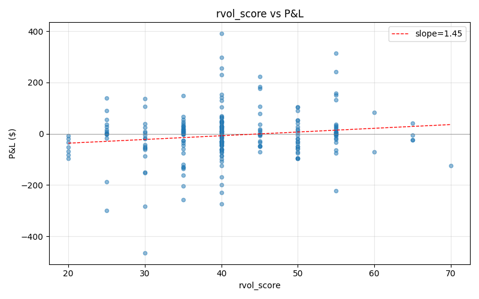
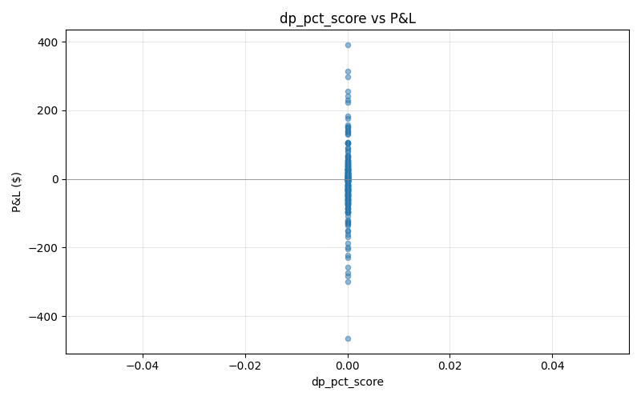
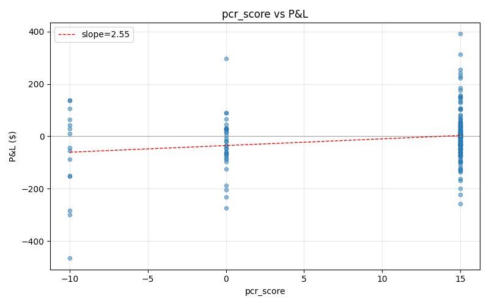
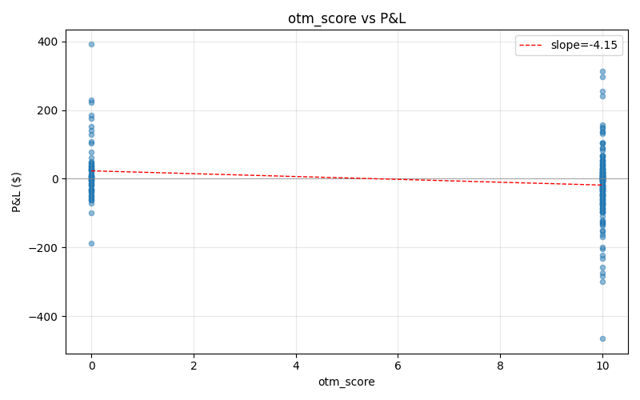
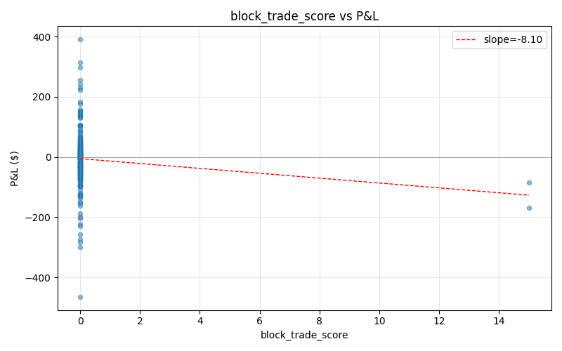
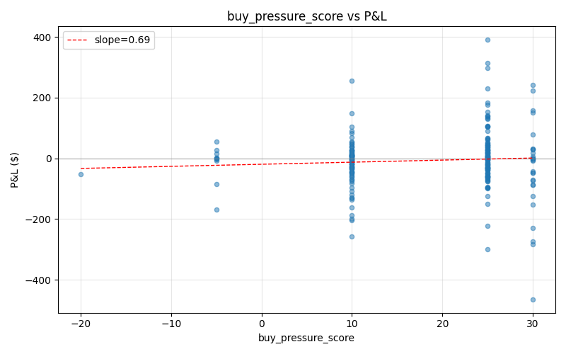

# IFDS Flow Sub-Component Decomposition

Scope: all available history | Trades: 294 | Enriched with snapshot: 232

Each flow sub-component is correlated against realized P&L to identify which ones actually predict outcomes.

Significance: `*` = p<0.05, `**` = p<0.01

## 1. Per-Component Correlation with P&L

| Component | N | Pearson | Spearman | Avg score |
|---|---|---|---|---|
| rvol_score | 232 | +0.147* (p=0.026) | +0.103 (p=0.118) | 40.91 |
| dp_pct_score | 232 | n/a | n/a | 0.00 |
| pcr_score | 232 | +0.203** (p=0.002) | +0.114 (p=0.082) | 11.19 |
| otm_score | 232 | -0.194** (p=0.003) | -0.184** (p=0.005) | 7.20 |
| block_trade_score | 232 | -0.117 (p=0.076) | -0.134* (p=0.042) | 0.13 |
| buy_pressure_score | 232 | +0.068 (p=0.301) | +0.038 (p=0.563) | 18.97 |
| squat_bar | 232 | +0.036 (p=0.588) | +0.038 (p=0.560) | 0.13 |

## 2. Quintile Analysis per Component

### rvol_score

| Quintile | Range | N | Avg P&L | Win rate |
|---|---|---|---|---|
| Q1 | 20.0–35.0 | 46 | $-36.35 | 41% |
| Q2 | 35.0–40.0 | 46 | $-21.21 | 48% |
| Q3 | 40.0–40.0 | 47 | $+19.05 | 62% |
| Q4 | 40.0–50.0 | 46 | $-3.87 | 46% |
| Q5 | 50.0–70.0 | 47 | $+7.79 | 40% |

**Q5–Q1 spread**: $+44.14

### dp_pct_score

| Quintile | Range | N | Avg P&L | Win rate |
|---|---|---|---|---|
| Q1 | 0.0–0.0 | 46 | $+3.34 | 59% |
| Q2 | 0.0–0.0 | 46 | $+24.80 | 54% |
| Q3 | 0.0–0.0 | 47 | $-26.66 | 53% |
| Q4 | 0.0–0.0 | 46 | $-7.86 | 50% |
| Q5 | 0.0–0.0 | 47 | $-26.46 | 21% |

**Q5–Q1 spread**: $-29.80

### pcr_score

| Quintile | Range | N | Avg P&L | Win rate |
|---|---|---|---|---|
| Q1 | -10.0–0.0 | 46 | $-47.72 | 39% |
| Q2 | 0.0–15.0 | 46 | $+7.42 | 63% |
| Q3 | 15.0–15.0 | 47 | $+25.97 | 57% |
| Q4 | 15.0–15.0 | 46 | $+10.30 | 59% |
| Q5 | 15.0–15.0 | 47 | $-29.89 | 19% |

**Q5–Q1 spread**: $+17.83

### otm_score

| Quintile | Range | N | Avg P&L | Win rate |
|---|---|---|---|---|
| Q1 | 0.0–0.0 | 46 | $+31.91 | 63% |
| Q2 | 0.0–10.0 | 46 | $+1.75 | 50% |
| Q3 | 10.0–10.0 | 47 | $-11.93 | 49% |
| Q4 | 10.0–10.0 | 46 | $-28.44 | 54% |
| Q5 | 10.0–10.0 | 47 | $-26.46 | 21% |

**Q5–Q1 spread**: $-58.37

### block_trade_score

| Quintile | Range | N | Avg P&L | Win rate |
|---|---|---|---|---|
| Q1 | 0.0–0.0 | 46 | $+12.86 | 63% |
| Q2 | 0.0–0.0 | 46 | $+18.23 | 52% |
| Q3 | 0.0–0.0 | 47 | $-28.54 | 51% |
| Q4 | 0.0–0.0 | 46 | $-3.91 | 50% |
| Q5 | 0.0–15.0 | 47 | $-31.35 | 21% |

**Q5–Q1 spread**: $-44.21

### buy_pressure_score

| Quintile | Range | N | Avg P&L | Win rate |
|---|---|---|---|---|
| Q1 | -20.0–10.0 | 46 | $-17.01 | 50% |
| Q2 | 10.0–25.0 | 46 | $-19.39 | 41% |
| Q3 | 25.0–25.0 | 47 | $+19.28 | 53% |
| Q4 | 25.0–25.0 | 46 | $+10.74 | 59% |
| Q5 | 25.0–30.0 | 47 | $-27.44 | 34% |

**Q5–Q1 spread**: $-10.43

## 3. Scatter Plots

## 4. Interpretation Hints

- **Positive, significant Pearson (p<0.05)** → keep / emphasize
- **Negative correlation** → consider removing or inverting
- **High N, r≈0** → noise; consider dropping
- **Low N but strong signal** → monitor for more data

---
*Generated by `scripts/analysis/flow_decomposition.py`*