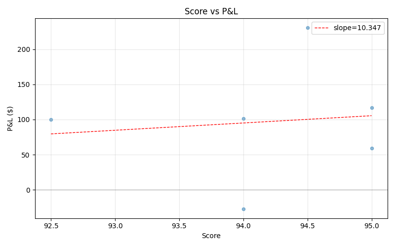
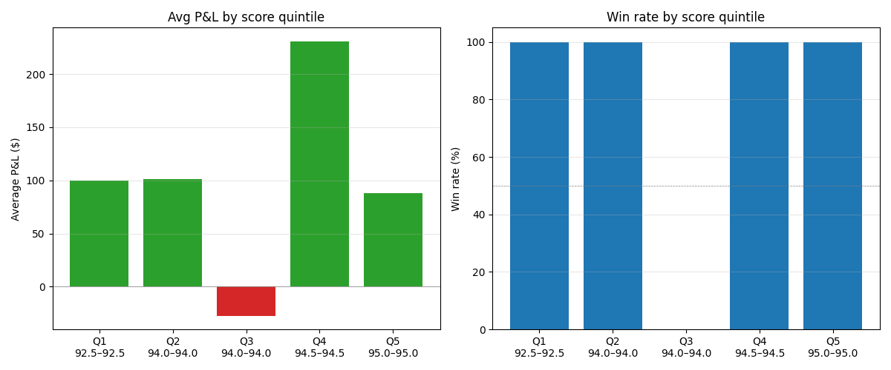

# IFDS Scoring Validation Report

Generated: 42 trading days | 6 trades | 42 Phase 4 snapshots | SPY returns: 35 days cached

## Scope

Standalone read-only analysis. Joins Phase 4 per-ticker scores with actual IBKR trade results to answer: **does the IFDS scoring system generate alpha, or is P&L a function of daily market direction only?**

Significance legend: `*` = p<0.05, `**` = p<0.01

## Overview

- Total trades: **6**
- Total P&L: **$+581.08**
- Win rate: **83.3%**
- Avg P&L per trade: **$+96.85**
- Median P&L: **$+100.58**
- Score range: 92.5–95.0

## 1. Score → P&L Correlation

- Pearson (score vs P&L $): +0.115 (p=0.829)
- Spearman (score vs P&L $): +0.265 (p=0.612)
- Pearson (score vs P&L %): +0.301 (p=0.563)

## 2. Score Quintile Analysis

| Quintile | Score range | N | Avg P&L | Median P&L | Avg % | Win rate | Total P&L |
|---|---|---|---|---|---|---|---|
| Q1 | 92.5–92.5 | 1 | $+100.10 | $+100.10 | +1.69% | 100.0% | $+100.10 |
| Q2 | 94.0–94.0 | 1 | $+101.06 | $+101.06 | +0.87% | 100.0% | $+101.06 |
| Q3 | 94.0–94.0 | 1 | $-27.30 | $-27.30 | -0.63% | 0.0% | $-27.30 |
| Q4 | 94.5–94.5 | 1 | $+230.77 | $+230.77 | +3.03% | 100.0% | $+230.77 |
| Q5 | 95.0–95.0 | 2 | $+88.22 | $+88.22 | +2.31% | 100.0% | $+176.45 |

**Top–bottom spread**: $-11.88 (Q5 avg $+88.22 vs Q1 avg $+100.10)

## 3. Win Rate by Score Bucket

| Score range | N | Win rate | Avg P&L | Avg % |
|---|---|---|---|---|
| 91–93 | 1 | 100.0% | $+100.10 | +1.69% |
| 93–999 | 5 | 80.0% | $+96.20 | +1.58% |

## 4. Score Component Impact

Snapshot join: **0 / 6** trades enriched with Phase 4 sub-scores.

Sub-score buckets reconstructed from snapshot fields:
- **flow**: rvol_score, dp_pct_score, pcr_score, otm_score, block_trade_score, buy_pressure_score
- **tech**: rsi_score, sma50_bonus, rs_spy_score
- **funda**: `funda_score`

## 5. Market Direction Control (SPY Excess Return)

⚠️  SPY returns cache is empty — cannot compute excess returns. Run with `--fetch-spy` (requires `IFDS_POLYGON_API_KEY`) to enable this section.

## 6. Exit Type Breakdown

| Exit type | N | Avg P&L | Median P&L | Avg % | Total P&L |
|---|---|---|---|---|---|
| MOC | 6 | $+96.85 | $+100.58 | +1.60% | $+581.08 |

## Summary

- Sample size: **6 trades** over 2 trading days
- Total P&L: **$+581.08** (+0.58% of $100k)
- Win rate: **83.3%**
- Q5–Q1 spread: **$-11.88**

---
*Generated by `scripts/analysis/scoring_validation.py`*