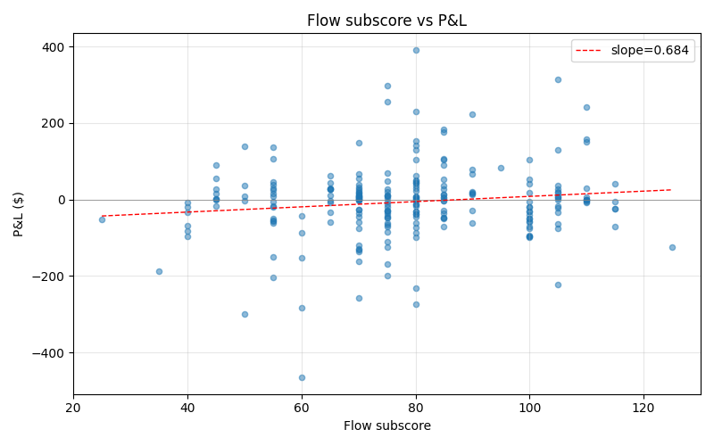
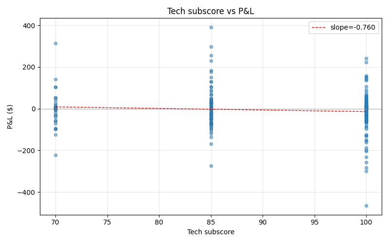
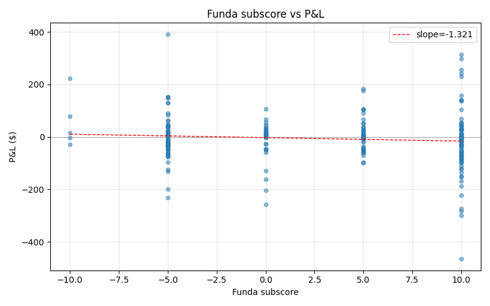
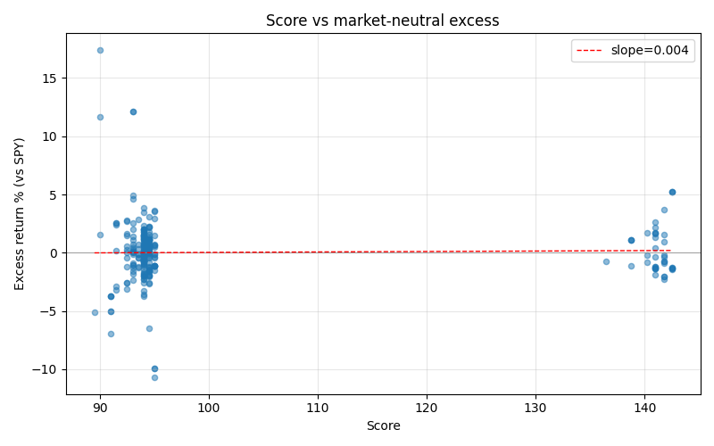

# IFDS Scoring Validation Report

Generated: 55 trading days | 378 trades | 53 Phase 4 snapshots | SPY returns: 35 days cached

## Scope

Standalone read-only analysis. Joins Phase 4 per-ticker scores with actual IBKR trade results to answer: **does the IFDS scoring system generate alpha, or is P&L a function of daily market direction only?**

Significance legend: `*` = p<0.05, `**` = p<0.01

## Overview

- Total trades: **378**
- Total P&L: **$-1,191.65**
- Win rate: **46.6%**
- Avg P&L per trade: **$-3.15**
- Median P&L: **$-1.25**
- Score range: 85.5–142.5

## 1. Score → P&L Correlation

- Pearson (score vs P&L $): -0.000 (p=0.996)
- Spearman (score vs P&L $): -0.007 (p=0.898)
- Pearson (score vs P&L %): +0.005 (p=0.929)

## 2. Score Quintile Analysis

| Quintile | Score range | N | Avg P&L | Median P&L | Avg % | Win rate | Total P&L |
|---|---|---|---|---|---|---|---|
| Q1 | 85.5–92.5 | 75 | $-1.72 | $-0.96 | +0.33% | 48.0% | $-129.20 |
| Q2 | 92.5–94.0 | 76 | $+11.57 | $+2.66 | +0.30% | 53.9% | $+879.65 |
| Q3 | 94.0–94.0 | 75 | $-17.88 | $-1.47 | -0.24% | 32.0% | $-1,341.23 |
| Q4 | 94.0–95.0 | 76 | $+1.01 | $+4.56 | -0.14% | 53.9% | $+76.44 |
| Q5 | 95.0–142.5 | 76 | $-8.91 | $-6.52 | -0.11% | 44.7% | $-677.31 |

**Top–bottom spread**: $-7.19 (Q5 avg $-8.91 vs Q1 avg $-1.72)

## 3. Win Rate by Score Bucket

| Score range | N | Win rate | Avg P&L | Avg % |
|---|---|---|---|---|
| 89–91 | 12 | 58.3% | $+43.92 | +2.17% |
| 91–93 | 70 | 44.3% | $-7.17 | -0.17% |
| 93–999 | 286 | 47.6% | $-2.84 | +0.01% |

## 4. Score Component Impact

Snapshot join: **232 / 378** trades enriched with Phase 4 sub-scores.

Sub-score buckets reconstructed from snapshot fields:
- **flow**: rvol_score, dp_pct_score, pcr_score, otm_score, block_trade_score, buy_pressure_score
- **tech**: rsi_score, sma50_bonus, rs_spy_score
- **funda**: `funda_score`

- Pearson (flow vs P&L): +0.136* (p=0.039)
- Pearson (tech vs P&L): -0.085 (p=0.198)
- Pearson (funda vs P&L): -0.088 (p=0.180)

## 5. Market Direction Control (SPY Excess Return)

SPY-joined: **252 / 378** trades.

Excess return = trade P&L % − SPY daily return % (beta assumption: 1.0)

- Pearson (score vs raw P&L%): +0.035 (p=0.575)
- Pearson (score vs **excess**): +0.025 (p=0.696)
- Spearman (score vs **excess**): -0.019 (p=0.762)

→ Score does not meaningfully correlate with P&L before or after SPY removal — inconclusive or no edge.

## 6. Exit Type Breakdown

| Exit type | N | Avg P&L | Median P&L | Avg % | Total P&L |
|---|---|---|---|---|---|
| LOSS_EXIT | 32 | $-98.50 | $-79.69 | -2.12% | $-3,152.08 |
| MOC | 280 | $+3.36 | $-0.29 | +0.07% | $+940.49 |
| NUKE | 9 | $+6.51 | $-37.72 | -0.11% | $+58.59 |
| SL | 15 | $-78.87 | $-36.30 | -1.74% | $-1,183.03 |
| TP1 | 36 | $+32.95 | $+9.64 | +1.44% | $+1,186.11 |
| TP2 | 3 | $+286.03 | $+391.50 | +10.49% | $+858.09 |
| TRAIL | 3 | $+33.39 | $+45.90 | +0.81% | $+100.18 |

## Summary

- Sample size: **378 trades** over 51 trading days
- Total P&L: **$-1,191.65** (-1.19% of $100k)
- Win rate: **46.6%**
- Q5–Q1 spread: **$-7.19**

---
*Generated by `scripts/analysis/scoring_validation.py`*