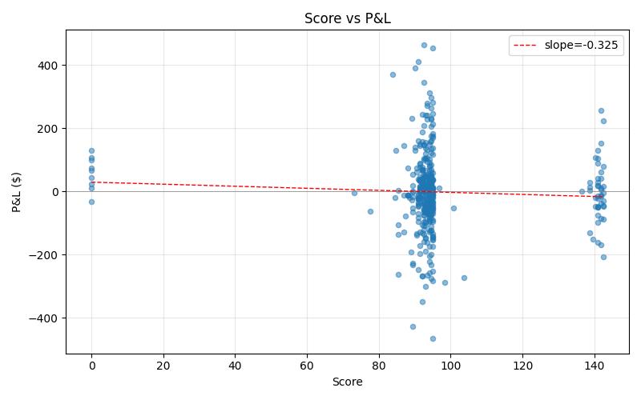
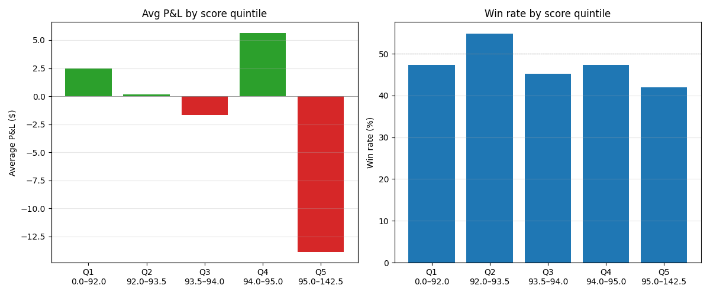
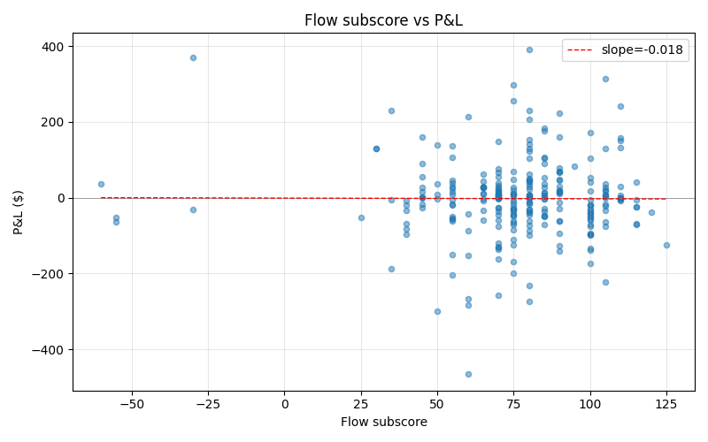
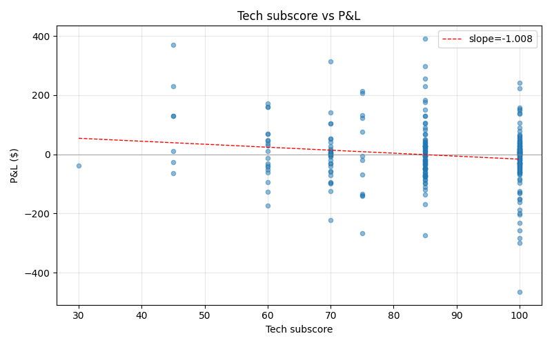
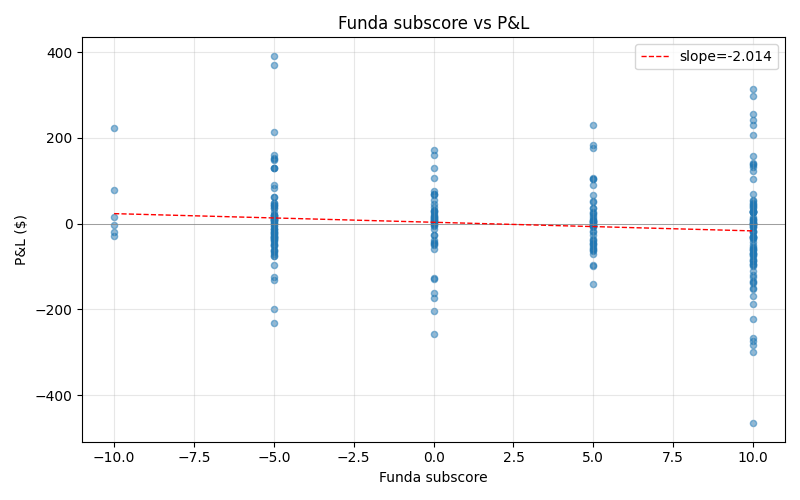
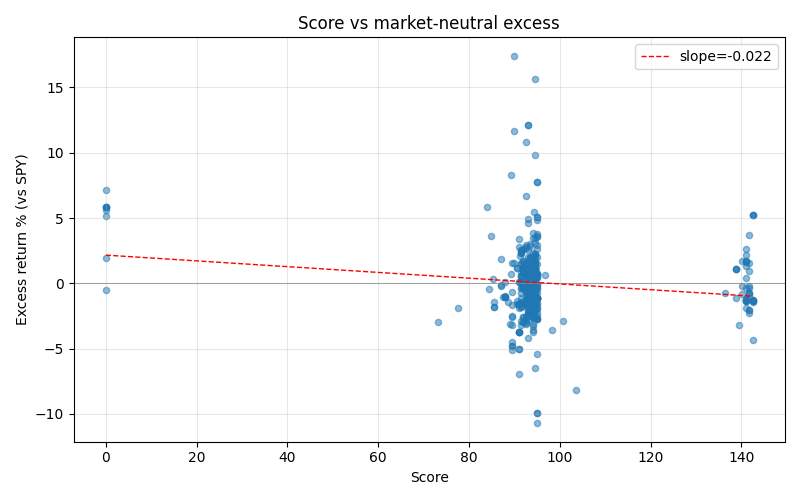

# IFDS Scoring Validation Report

Generated: 32 trading days | 465 trades | 95 Phase 4 snapshots | SPY returns: 88 days cached

## Scope

Standalone read-only analysis. Joins Phase 4 per-ticker scores with actual IBKR trade results to answer: **does the IFDS scoring system generate alpha, or is P&L a function of daily market direction only?**

Significance legend: `*` = p<0.05, `**` = p<0.01

## Overview

- Total trades: **465**
- Total P&L: **$-672.32**
- Win rate: **47.3%**
- Avg P&L per trade: **$-1.45**
- Median P&L: **$-0.83**
- Score range: 0.0–142.5

## 1. Score → P&L Correlation

- Pearson (score vs P&L $): -0.056 (p=0.230)
- Spearman (score vs P&L $): -0.048 (p=0.298)
- Pearson (score vs P&L %): -0.117* (p=0.011)

## 2. Score Quintile Analysis

| Quintile | Score range | N | Avg P&L | Median P&L | Avg % | Win rate | Total P&L |
|---|---|---|---|---|---|---|---|
| Q1 | 0.0–92.0 | 93 | $+2.48 | $-2.52 | +0.40% | 47.3% | $+230.70 |
| Q2 | 92.0–93.5 | 93 | $+0.18 | $+4.14 | +0.38% | 54.8% | $+17.08 |
| Q3 | 93.5–94.0 | 93 | $-1.67 | $-1.23 | -0.04% | 45.2% | $-155.53 |
| Q4 | 94.0–95.0 | 93 | $+5.64 | $-0.76 | +0.17% | 47.3% | $+524.26 |
| Q5 | 95.0–142.5 | 93 | $-13.86 | $-12.83 | -0.25% | 41.9% | $-1,288.83 |

**Top–bottom spread**: $-16.34 (Q5 avg $-13.86 vs Q1 avg $+2.48)

## 3. Win Rate by Score Bucket

| Score range | N | Win rate | Avg P&L | Avg % |
|---|---|---|---|---|
| 89–91 | 20 | 45.0% | $-20.22 | +0.65% |
| 91–93 | 99 | 51.5% | $+5.59 | +0.13% |
| 93–999 | 318 | 46.2% | $-3.77 | +0.03% |

## 4. Score Component Impact

Snapshot join: **271 / 465** trades enriched with Phase 4 sub-scores.

Sub-score buckets reconstructed from snapshot fields:
- **flow**: rvol_score, dp_pct_score, pcr_score, otm_score, block_trade_score, buy_pressure_score
- **tech**: rsi_score, sma50_bonus, rs_spy_score
- **funda**: `funda_score`

- Pearson (flow vs P&L): -0.005 (p=0.940)
- Pearson (tech vs P&L): -0.148* (p=0.015)
- Pearson (funda vs P&L): -0.126* (p=0.038)

## 5. Market Direction Control (SPY Excess Return)

SPY-joined: **465 / 465** trades.

Excess return = trade P&L % − SPY daily return % (beta assumption: 1.0)

- Pearson (score vs raw P&L%): -0.117* (p=0.011)
- Pearson (score vs **excess**): -0.153** (p=0.001)
- Spearman (score vs **excess**): +0.009 (p=0.841)

→ Score correlates with market-neutral excess return. **Evidence of alpha.**

## 6. Exit Type Breakdown

| Exit type | N | Avg P&L | Median P&L | Avg % | Total P&L |
|---|---|---|---|---|---|
| LOSS_EXIT | 47 | $-104.96 | $-75.71 | -2.22% | $-4,933.21 |
| MENTAL_SL | 1 | $-272.27 | $-272.27 | -8.46% | $-272.27 |
| MOC | 332 | $+9.36 | $+1.43 | +0.27% | $+3,107.74 |
| NUKE | 9 | $+6.51 | $-37.72 | -0.11% | $+58.59 |
| SL | 17 | $-96.46 | $-43.83 | -2.14% | $-1,639.85 |
| TIME_STOP | 3 | $-101.42 | $-19.27 | -1.51% | $-304.26 |
| TP1 | 43 | $+34.73 | $+10.00 | +1.52% | $+1,493.52 |
| TP2 | 6 | $+296.83 | $+358.31 | +10.33% | $+1,781.00 |
| TRAIL | 7 | $+5.20 | $-12.83 | +0.12% | $+36.42 |

## Summary

- Sample size: **465 trades** over 71 trading days
- Total P&L: **$-672.32** (-0.67% of $100k)
- Win rate: **47.3%**
- Q5–Q1 spread: **$-16.34**

---
*Generated by `scripts/analysis/scoring_validation.py`*